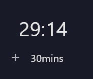

# Turn off⌚️💻

[](https://img.shields.io/badge/version-1.0-green)
[](https://img.shields.io/badge/license-mit-blue)
[](https://img.shields.io/badge/language-Python3-red)

Application for scheduling the shutdown of a windows pc



## Installation ⚙️
1. Fork/Clone/Download this repo

    `git clone https://github.com/DaniFdz/TurnOff.git`

2. Navigate to the directory

    `cd TurnOff`

3. Create a virtual environment for this project

    ```bash
    python -m pip install venv
    python -m venv venv
    ```

4. Load the virtual environment: `.\venv\Scripts\activate.ps1`
  
5. Run the next commands:

 ```ps1
pip install -r requirements.txt
cd src
pyinstaller .\src\TurnOff.py --noconsole --noconfirm --onefile --icon .\src\icon.ico 
```

## Usage 🌝
1. Go to the `dist` folder
2. Execute the main.exe file

## Updating ⬇️

To update the app with the stable release just pull the latest commit using Git.

1. Make sure you are in the master branch running: `git checkout master`
2. Download the latest version: `git pull origin master`


## Contributing 💡

You can propose a feature request opening an issue or a pull request.

Here is a list of TurnOff's contributors:

<a href="https://github.com/DaniFdz/TurnOff/contributors">
  
</a>

This project uses [MIT licensed](./LICENSE).